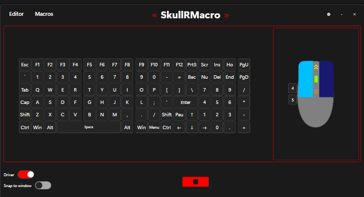
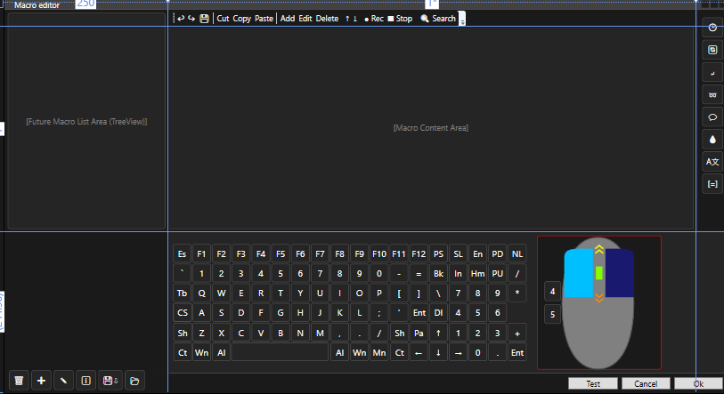

# SkullRMacro 🎮🖱️
**A powerful macro recording and playback tool for Windows. Supports keyboard & mouse automation, pixel/image triggers, and Lua scripting. Built in C#.**

---

## 🚀 Features
- 🎹 **Interactive Macro Recording** – Keyboard & mouse hooks
- 🎯 **Pixel & Image-Based Triggers** – OpenCV support
- 💻 **Lua Scripting Engine** – Automate anything
- 🖼️ **Visual UI** – Drag-and-drop editor with key/mouse map
- 🔐 **Driver-Level Injection** – Low latency, anti-cheat aware

---

## 📦 Project Status
🚧 *In development* – UI under construction, core modules WIP.

---

## 📸 Screenshots

| Keyboard View | Mouse View |
|---------------|------------|
|  |  |

---

## 🛠️ Tech Stack
- C# (.NET / WPF)
- C++ (Driver / Core)
- OpenCV (image triggers)
- Lua (macro scripting)
- GitHub Actions (CI/CD)
---
